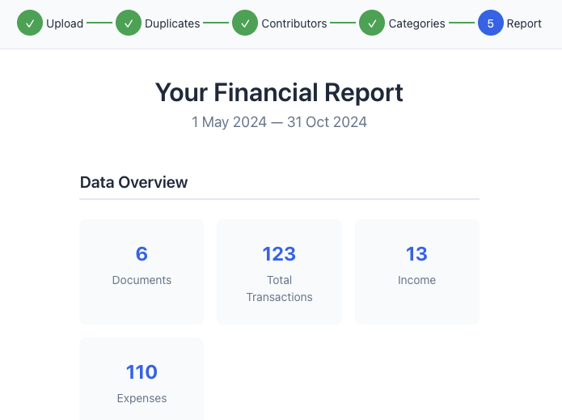
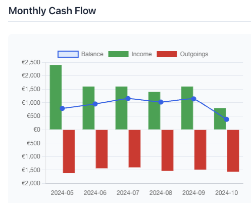
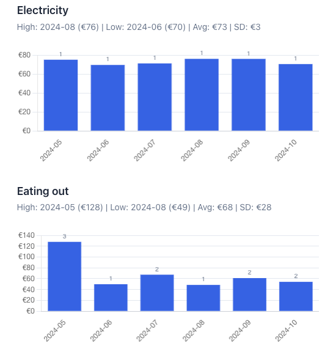

# Joint Account Analyser

**[Try it live](https://jackwaddington.github.io/online_private_bank_statement_analyser/)** - No signup, no data leaves your browser. Don't have Nordea statements handy? The landing page includes six months of sample data so you can try the full workflow instantly.

A privacy-first tool for couples to analyse shared bank accounts. Upload Nordea CSV exports, categorise spending, track contributions, and see where your money goes.







## Features

- **Complete privacy** - all processing happens in your browser, nothing sent to any server
- **Try before you upload** - built-in sample data lets you explore every feature without your own statements
- **Duplicate detection** - automatically finds overlapping transactions across statement files
- **Smart categorisation** - pattern matching with bulk assignment by keyword
- **Contribution tracking** - see who paid what and calculate equalisation amounts
- **Monthly trends** - charts showing spending patterns over time
- **Session autosave** - work in progress is saved locally in your browser, so a refresh won't lose it (still nothing leaves your device)
- **Clean export** - download organised CSVs and a groupings file to continue next month

## Future Plans

- Support for more bank formats (currently Nordea only)
- Recurring transaction detection
- Budget targets and alerts

## Running Locally

```bash
cd web
npm install
npm run dev
```

## Testing

The core logic (parsing, deduplication, categorisation, contribution calculations) is covered by a Vitest suite:

```bash
cd web
npm run test:run   # run once
npm run test       # watch mode
npm run lint
```

Every push to `main` runs lint, tests, and the build in CI before deploying to GitHub Pages.

## Tech

React 19, TypeScript, Vite, styled-components, Chart.js, Papa Parse (CSV parsing), zod (input validation), JSZip (export bundling).
